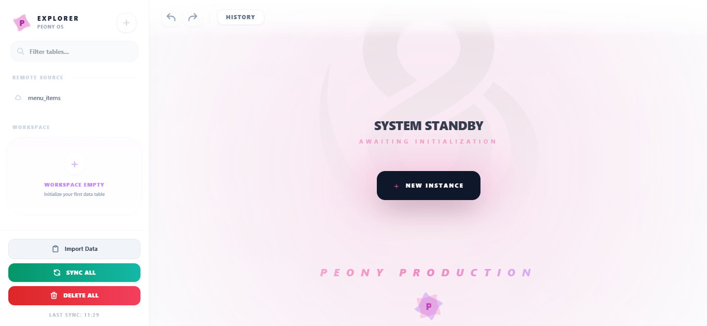
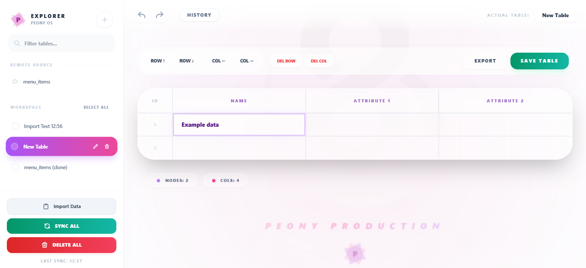
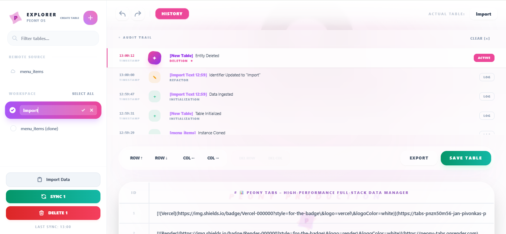

# 📊 Peony Tabs – High-Performance Full-Stack Data Manager

[](https://tabs-pnzn50m56-jan-pivonkas-projects.vercel.app/)
[](https://peony-tabs.onrender.com)
[](https://reactjs.org/)
[](https://nodejs.org/)
[](https://www.postgresql.org/)

---

## 📝 Project Vision & Goal

Peony Tabs is a **production-ready full-stack web application** for managing structured tabular data, with a strong emphasis on:

* instant persistence between UI and database,
* non-destructive editing via time-travel history,
* and strict separation of domain logic from the presentation layer.

The project evolved from a functional prototype into a robust system designed to reflect **real-world application architecture**, predictable state management, and scalable frontend–backend integration.

The primary goal of the project is to demonstrate:

* system-oriented and domain-driven thinking,
* advanced client-side state orchestration,
* real-time data synchronization backed by PostgreSQL.

---

## 🚀 Live Demo

**Frontend (Vercel):**
👉 [https://peony-tabs.vercel.app/](https://peony-tabs.vercel.app/)

**Backend API (Render):**
👉 [https://peony-tabs.onrender.com](https://peony-tabs.onrender.com)

---

## ✨ Key Features & Enhancements

### 🕒 Advanced Time-Travel History

* **Undo / Redo Engine** – fully operational snapshot-based history system
* **Interactive Timeline** – one-click restoration of any previous application state
* **Contextual Descriptions** – human-readable logs for every mutation (e.g. `[Inventory] Attribute Added`)

### 🗂️ Professional Sidebar & Bulk Actions

* **Database Sync Indicators** – real-time visibility of persistence state
* **Multi-Select Operations** – batch cloning and deletion of tables
* **Dynamic Navigation** – instant switching between local drafts and database-backed tables

### ✍️ Intelligent Table Editor

* **Export Engine** – one-click JSON export of sanitized domain data
* **Smart Clipboard** – copy & paste with automatic row/column normalization
* **Safe Mutations** – confirmation modals and strict state validation

### 🎨 Polished UI / UX

* **Modern Design** – clean, professional interface built for power users
* **Fluid Feedback** – micro-animations for state transitions and async operations
* **Localization** – fully English interface for global accessibility

---

## 🏗️ Application Architecture

The application is split into a **dedicated frontend and backend**, each with clearly defined responsibilities and a production-grade structure.

### 🔹 Backend (Node.js + TypeScript)

The backend follows a layered architecture designed for scalability and maintainability.

**Backend characteristics:**

* **Controller → Service → Repository** pattern
* **Prisma ORM** for type-safe database access
* **PostgreSQL** as the primary persistence layer
* **Real-time layer** using PostgreSQL triggers and Socket.io
* centralized validation and error-handling mechanisms

Each domain module encapsulates its own:

* routes
* controllers
* services
* repositories

---

### 🔹 Frontend (React + TypeScript)

The frontend is built with a strong focus on **logic–UI decoupling** and predictable state transitions.

Core principles:

* feature-first component organization
* application logic extracted into custom hooks (`useApp`, `useHistory`, `useTables`)
* UI components focused primarily on rendering
* hybrid persistence between LocalStorage and remote database

A significant part of the frontend is dedicated to **history orchestration**, enabling safe undo / redo operations across all table mutations.

Styling is implemented using **Tailwind CSS**, allowing rapid UI iteration while maintaining visual consistency.

---

## 📈 Roadmap & Future Improvements

While the application is fully usable, the following features are planned for future iterations:

* **Authentication & RBAC**

  * Free user – read-only access
  * Standard user – full CRUD on owned tables
  * Superuser – global administrative control
* **Multi-user collaboration** – real-time presence indicators
* **Advanced cell types** – dropdowns, dates, and media support
* **Optimistic UI updates** for enhanced perceived performance

---

## 📂 Project Structure

```text
tabs/
├─ backend/             # Node.js + Prisma + Socket.io
├─ frontend/            # React + Tailwind + Vite
└─ README.md
```

---

## 📸 Screenshots

### Home Page



### Table Clicked



### History



---

## 👤 Author

**Peony 🌸**
Visionary of Connections...
