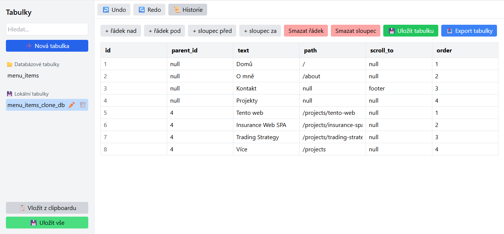
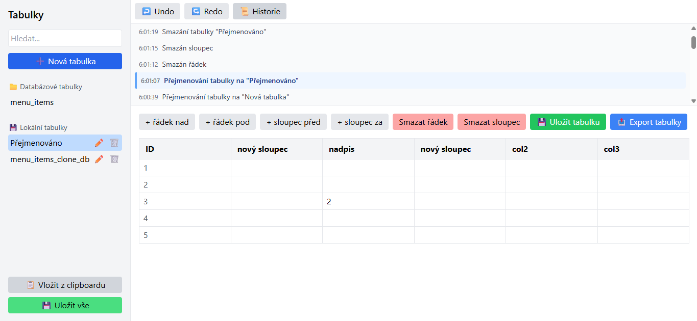
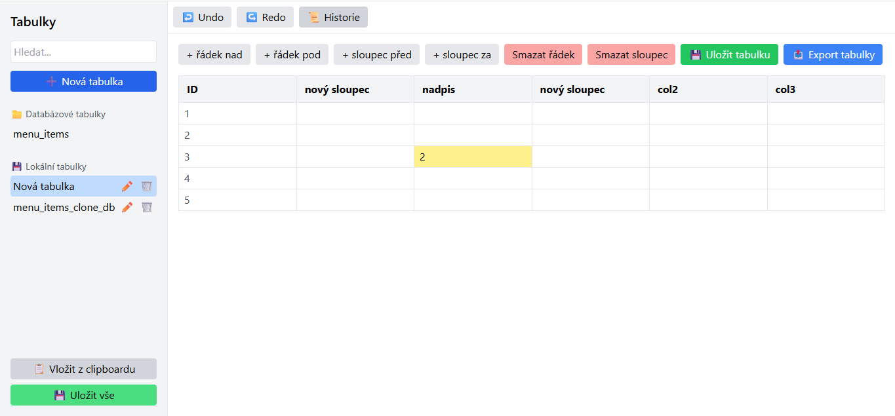

# 📊 Tabs – Full-Stack Application for Tabular Data Management

[](https://tabs-orcin-five.vercel.app/)
[](https://tabs-production.up.railway.app/)
[](https://reactjs.org/)
[](https://nodejs.org/)
[](https://www.postgresql.org/)

---

## 📝 Context and Project Goal

Tabs is a **full-stack web application** designed for managing structured tabular data with a strong focus on:

* change history handling,
* undo / redo mechanics,
* and strict separation of domain logic from the UI layer.

The project serves as a practical demonstration of designing a modern full-stack application that combines a robust backend API with a highly interactive frontend.

The primary goal was to demonstrate:

* system-oriented and domain-driven thinking,
* predictable state management,
* real-world frontend-to-database integration.

---

## 🚀 Live Demo

**Frontend (Vercel):**
👉 [https://tabs-orcin-five.vercel.app/](https://tabs-orcin-five.vercel.app/)

**Backend API (Railway):**
👉 [https://tabs-production.up.railway.app/](https://tabs-production.up.railway.app/)

---

## 🏗️ Application Architecture

The project is split into a **dedicated frontend and backend**, each with clearly defined responsibilities and a production-ready structure.

### 🔹 Backend

The backend is implemented using **Node.js + TypeScript** and designed according to layered architecture principles.

**Backend characteristics:**

* **Controller → Service → Repository** architecture
* **Prisma ORM** for type-safe database access
* **PostgreSQL** as the persistence layer
* centralized error handling and validation layer

Each domain module (e.g. `table`) encapsulates its own:

* routes
* controllers
* services
* repositories
* validators

This structure allows the backend to scale naturally as additional domains are introduced.

### 🔹 Frontend

The frontend is built with **React + TypeScript** with a strong emphasis on **logic–UI decoupling**.

Core principles:

* feature-first component structure
* application logic extracted into custom hooks (`useApp`, `useHistory`, `useTables`, …)
* UI components focused primarily on rendering
* predictable state transitions, even for complex operations

A significant part of the application is dedicated to **change history management**, enabling undo / redo operations for tabular data mutations.

Styling is implemented using **Tailwind CSS**, enabling fast UI iteration while maintaining visual consistency.

---

## ✨ Key Features

* **Table Editor** – creating, editing, renaming, and deleting tables
* **Undo / Redo Engine** – snapshot-based change history
* **Clipboard Integration** – currently **not functional**, prepared for future implementation
* **Sidebar Navigation** – structured table management with contextual actions
* **Safe Destructive Actions** – confirmation modals for delete operations
* **Desktop SPA** – application designed primarily for desktop usage

---

## ⚠️ Current State and Limitations

The application is currently in a functional prototype phase with a clearly defined direction for further development:

* **The frontend currently operates in read-only mode**, consuming data from the database
* **API endpoints for data persistence** are implemented on the backend but **are not yet connected to the frontend**
* **Clipboard paste functionality** is currently **non-functional** and requires a dedicated implementation
* **History navigation** will be extended with `onClick` interactions for individual snapshot entries

These limitations are intentional and reflect an iterative development approach.

---

## 🛠️ Tech Stack

### Frontend

* React 18
* TypeScript
* Vite
* Tailwind CSS

### Backend

* Node.js
* TypeScript
* Express
* Prisma ORM
* PostgreSQL

### Infrastructure

* **Frontend hosting:** Vercel
* **Backend hosting:** Railway
* **Database:** PostgreSQL

---

## 📂 Project Structure

```text
tabs/
├─ backend/
│  ├─ src/
│  │  ├─ modules/        # Domain modules (controller, service, repository)
│  │  └─ shared/         # Middleware, errors, Prisma client
│  ├─ prisma/            # Prisma schema and migrations
│  └─ server.ts          # Application entry point
│
├─ frontend/
│  ├─ src/
│  │  ├─ components/     # UI components (tables, sidebar, history)
│  │  ├─ hooks/          # Application and domain logic
│  │  ├─ domain/         # Shared domain models
│  │  └─ lib/            # Utilities and storage
│  └─ main.tsx
│
└─ README.md
```

---

## 📸 Screenshots

### Database-backed table



### Change history (Undo)



### Local table



---

## ⚙️ Local Development

### Backend

```bash
cd backend
npm install
npm run dev
```

### Frontend

```bash
cd frontend
npm install
npm run dev
```

---

## 📈 Roadmap and Future Improvements

* **Connecting frontend write operations to backend API** for full database persistence
* **Clipboard engine implementation** (validation, cell mapping, edge cases)
* **Interactive change history** – clickable snapshots with instant state restoration
* **User roles and permissions**:

  * administrator (full database access)
  * standard user (partial access)
  * read-only mode
* **Authentication and authorization**
* **Collaborative editing (multi-user support)**
* **Optimistic UI updates**

---

## 👤 Author

**Peony 🌸**

GitHub: [https://github.com/peony](https://github.com/peony)
